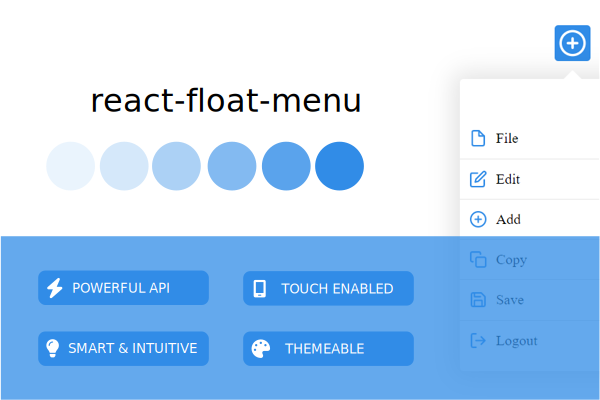

<p align="center">
  <a href="">
    
  </a>
</p>

<p align="center">
  <a href="https://www.npmjs.com/package/react-float-menu"></a>
  <a href="https://img.shields.io/bundlephobia/minzip/react-float-menu"></a>
  <a href="https://opensource.org/licenses/MIT"></a>
  <a href="https://snyk.io/test/github/prabhuignoto/react-float-menu"></a>
  <a href="https://app.codiga.io/hub/project/34090/react-float-menu"></a>
  <a href="https://depfu.com/github/prabhuignoto/react-float-menu?project_id=36049"></a>
  <a href="https://github.com/prabhuignoto/react-float-menu/actions/workflows/cypress.yml"></a>
</p>


<h2>Features</h2>

- ⚡ Configurable and smart floating menu for react
- ⚙️ Comes with a lot of options to customize the  behavior of the menu
- 🎨 Customize colors with ease
- 📱 Seamless support for mobile and desktop
- 💪 Built with Typescript

<h2>Table of Contents</h2>

- [📦 Installation](#-installation)
- [🚀 Getting started](#-getting-started)
- [⚙️ Properties](#️-properties)
  - [items](#items)
- [🎨 Theme](#-theme)
- [🧪 Tests](#-tests)
- [🍫 CodeSandbox Examples](#-codesandbox-examples)
- [🤝 Contributing](#-contributing)
- [📃 Meta](#-meta)

## 📦 Installation

Install the package with `npm` or `yarn`.

```bash
  npm install react-float-menu
```

or

``` bash
  yarn add react-float-menu
```

## 🚀 Getting started

Let's get started by creating a new floating menu with drag super power.

```jsx
  <Menu
    dimension={40}
    items={[
      { name: "File" },
      {
        children: [
          { children: [{ name: "Cut 1" }, { name: "Cut 2" }], name: "Cut" },
          { name: "Select All" },
        ],
        name: "Edit",
      },
      { name: "Add" },
      {
        children: [
          { name: "Copy from clipboard" },
          { name: "Copy selection" },
        ],
        name: "Copy",
      },
      { name: "Save" },
      { name: "Logout" },
    ]}
    shape="square"
    startPosition="top left"
    width={250}
    onSelect={(val) => console.log(val)}
  >
    <PlusIcon />
  </Menu>
```

## ⚙️ Properties

| name                | description                                                                                                               | default    |
| :------------------ | :------------------------------------------------------------------------------------------------------------------------ | :--------- |
| autoFlipMenu        | Flips the menu when the button is at the bottom of the screen and there is no space to display the menu                   | true       |
| bringMenuToFocus    | Automatically moves the menu and brings it to focus when the menu is activated from the left or right edge of the screen. | true       |
| closeOnClickOutside | Closes the menu if you touch or click outside the menu.                                                                   | true       |
| dimension           | Sets the height and width of the button                                                                                   | 30         |
| disableHeader       | Disables the header section of the menu.                                                                                  | false      |
| iconSize            | Size of the menu item icons                                                                                               | "1rem"     |
| items               | Collection of menu items. Please refer [Menu item model](#menu-item-model)                                                | []         |
| pin                 | Disables dragging and pins the menu. The button's initial placement will be determined by `startPosition`                 | 30         |
| shape               | Shape of the button. can be `square` or `circle`                                                                          | `circle`   |
| RTL                 | Renders the menu items right to left. The submenu's will open to the `left side`.                                         | False      |
| startPosition       | Starting position of the button. can be `top left`,`top right`,`bottom left`,`bottom right`                               | `top left` |
| theme               | With the `theme` object, you can change the colors of different elements.                                                 |            |
| width               | Width of the menu                                                                                                         | 30         |

### items

`items` is an array of menu item objects. A menu item represents the individual menu item and its properties.

| name     | description                                                                                            |
| :------- | :----------------------------------------------------------------------------------------------------- |
| name     | Label of the menu item                                                                                 |
| id       | Unique id of the menu item. This is optional as the ids are automatically generated by the library     |
| children | The prop takes an array of Menu item objects and it will be rendered as the submenu for this menu item |
| icon     | Use this prop to display a icon for the menu item                                                      |
| selected | This is an internal prop that is set to true when the menu item is selected                            |

> submenus are activated by clicking on the menu item or by hovering over the menu item.

## 🎨 Theme

Use the theme object to customize the colors of the different elements of the menu.

| name                   | description                                        | default |
| :--------------------- | :------------------------------------------------- | :------ |
| menuBackgroundColor    | background color of the menu                       | #FFFFFF |
| menuItemHoverColor     | background color of the menu item when its hovered | #318CE7 |
| menuItemHoverTextColor | Text color of the menu item when its hovered       | #fff    |
| primary                | Primary color or the predominant color of the menu | #318CE7 |
| secondary              | Secondary color of the menu                        | #FFFFFF |

```jsx

import {Menu} from 'react-float-menu';

<Menu
  startPosition="top right"
  theme={{
    menuBackgroundColor: "#FFFFFF",
    menuItemHoverColor: "#318CE7",
    menuItemHoverTextColor: "#fff",
    primary: "#318CE7",
    secondary: "#FFFFFF",
  }}
/>

```

## 🧪 Tests

We use [cypress](https://docs.cypresshq.com/guides/guides/introduction/getting-started/) to test the library.

To run the tests, run the following command in the root directory of the project.

```bash
  pnpm install
  pnpm run cypress:open
```

## 🍫 CodeSandbox Examples

1. [Basic](https://codesandbox.io/s/black-dawn-xzw0xd)
2. [Pinned Menu](https://codesandbox.io/s/staging-darkness-ycfqkm)
3. [Custom Colors](https://codesandbox.io/s/cocky-satoshi-hkm28g)
4. [RTL](https://codesandbox.io/s/interesting-haslett-ulv3re)

## 🤝 Contributing

1. [Fork it](https://github.com/prabhuignoto/react-float-menu/fork)
2. Create your feature branch (git checkout -b new-feature)
3. Commit your changes (git commit -am 'Add feature')
4. Push to the branch (git push origin new-feature)
5. Create a new Pull Request

Check out the [contributing guide](/CONTRIBUTING.md) for more details.

## 📃 Meta

Distributed under the MIT license. See `LICENSE` for more information.

Prabhu Murthy – [@prabhumurthy2](https://twitter.com/prabhumurthy2) – prabhu.m.murthy@gmail.com
[https://github.com/prabhuignoto](https://github.com/prabhuignoto)
